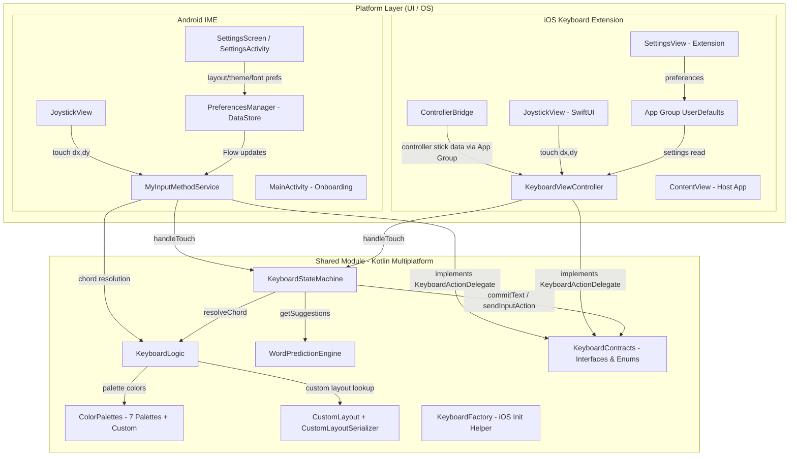
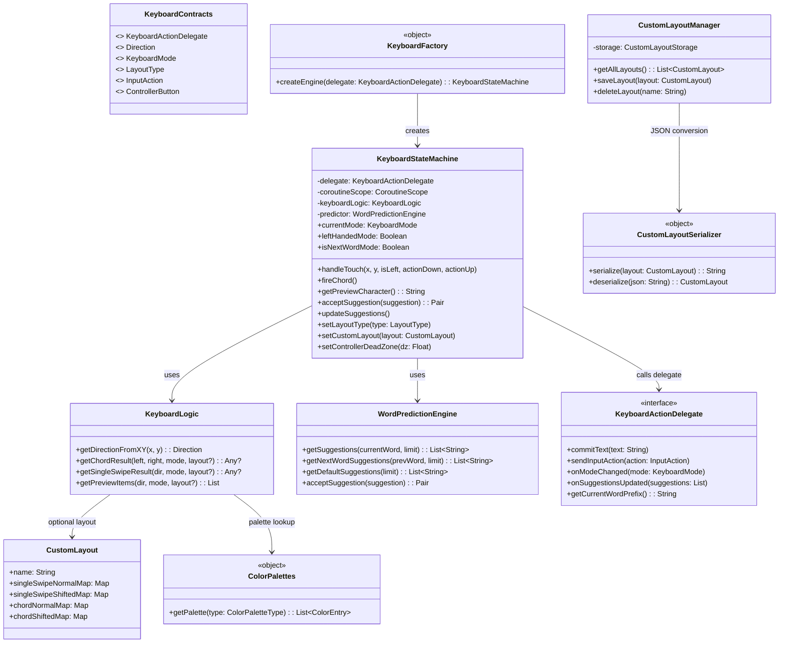
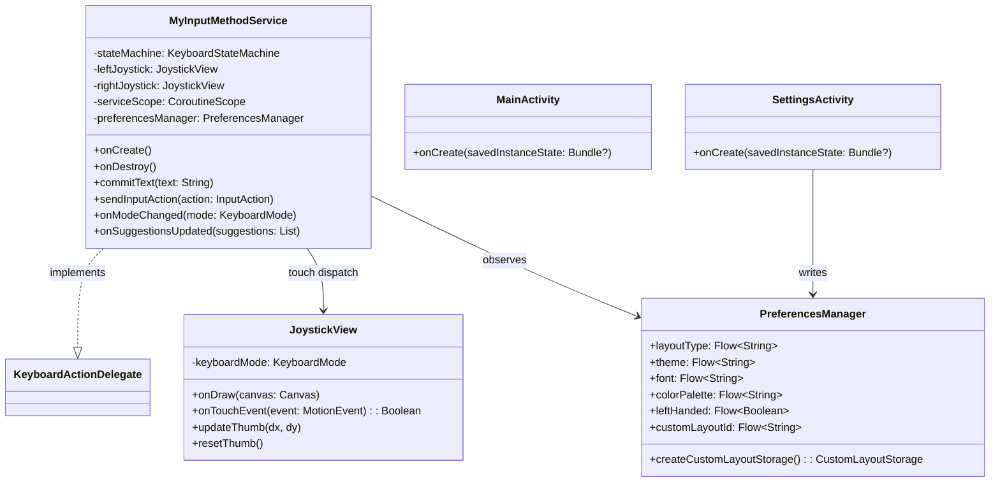
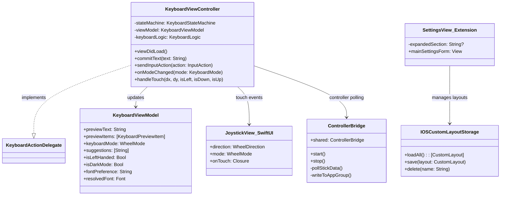
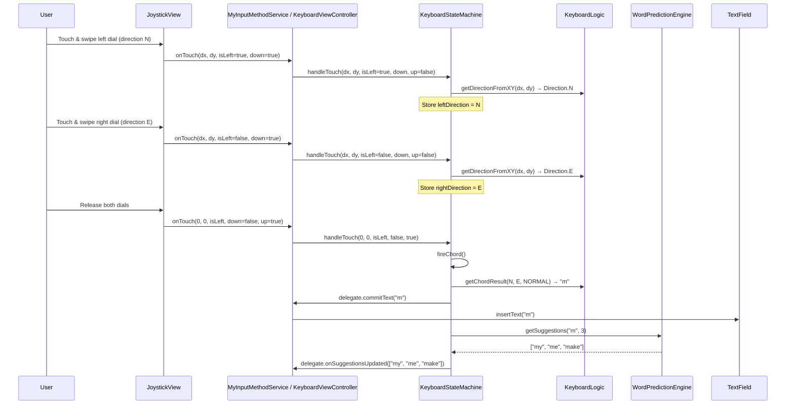
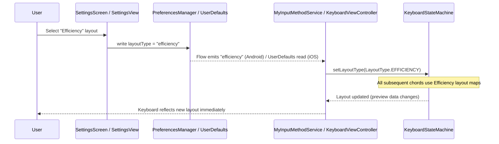
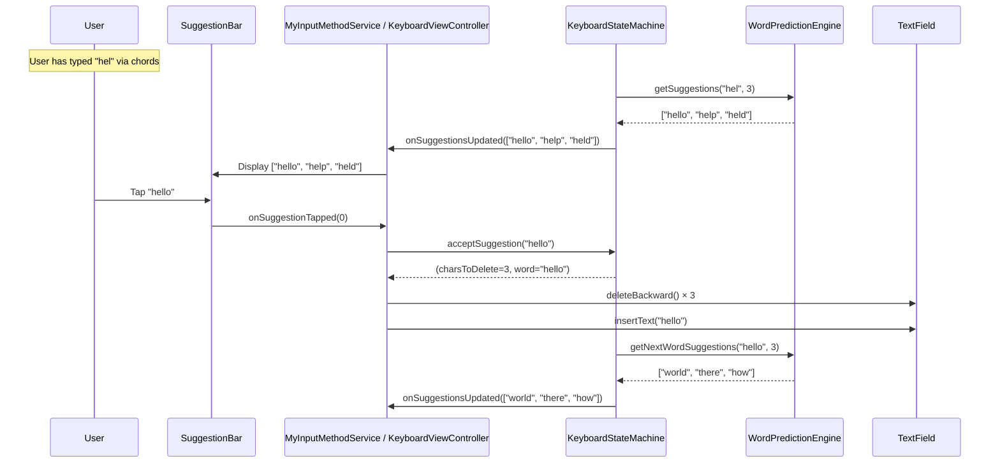

# ERICK - Application Context & Architecture

Canonical source note: the repo-root `APP_CONTEXT.md` is authoritative, and `docs/documentation/APP_CONTEXT.md` is a mirrored copy for docs navigation. Update the root file first and sync the docs copy intentionally.

**Version**: 1.0  
**Last Updated**: April 22, 2026  
**Project**: Ergonomic Radial Inclusive Controller Keyboard (ERICK)
**Distribution**: Android is live on Google Play at `https://play.google.com/store/apps/details?id=com.vatoo.erick`; the iOS App Store release is coming soon.

## Executive Summary

ERICK is a cross-platform keyboard system for Android and iOS that replaces rows of tiny keys with two large directional controls. Users type by combining left and right movements into character chords using touch or a physical game controller. The application uses Kotlin Multiplatform to share core keyboard logic between Android and iOS implementations, including layout handling, prediction, accessibility behavior, and controller support.

## Architecture Overview

### High-Level System Architecture
```
┌─────────────────────────────────────────────────────────┐
│                 Platform Layer (UI/OS)                  │
│  ┌─────────────────────┐      ┌─────────────────────┐   │
│  │   Android IME       │      │   iOS Extension     │   │
│  │  - MyInputMethod    │      │  - KeyboardView     │   │
│  │    Service          │      │    Controller       │   │
│  │  - JoystickView     │      │  - JoystickView     │   │
│  │  - XML Layout       │      │    (SwiftUI)        │   │
│  │  - DataStore prefs  │      │  - App Group prefs  │   │
│  └──────────┬──────────┘      └──────────┬──────────┘   │
└─────────────┼────────────────────────────┼──────────────┘
              │                            │
              └──────────┬─────────────────┘
                         │
┌────────────────────────▼────────────────────────────────┐
│          Shared Module (Kotlin Multiplatform)           │
│  ┌─────────────────────────────────────────────────┐    │
│  │  KeyboardStateMachine                           │    │
│  │  - Chord input processing & state tracking      │    │
│  │  - Word buffer management                       │    │
│  │  - Suggestion orchestration                     │    │
│  │  - Accelerating backspace logic                 │    │
│  │  - Controller input normalization               │    │
│  └─────────────────────────────────────────────────┘    │
│  ┌─────────────────────────────────────────────────┐    │
│  │  KeyboardLogic                                  │    │
│  │  - Direction mapping (8-way and 6-way radial)   │    │
│  │  - Character resolution (Logical/Efficiency)    │    │
│  │  - Custom layout support                        │    │
│  │  - Symbols mode chord maps (6-section)          │    │
│  └─────────────────────────────────────────────────┘    │
│  ┌─────────────────────────────────────────────────┐    │
│  │  WordPredictionEngine                           │    │
│  │  - Trie-based word completions                  │    │
│  │  - Bigram next-word predictions                 │    │
│  │  - Levenshtein edit-distance autocorrect        │    │
│  │  - ~700 word dictionary with frequency tiers    │    │
│  └─────────────────────────────────────────────────┘    │
│  ┌──────────────────────────────────────────────────┐   │
│  │  KeyboardContracts                               │   │
│  │  - Interfaces and data classes                   │   │
│  │  - Platform abstractions (KeyboardActionDelegate)│   │
│  └──────────────────────────────────────────────────┘   │
│  ┌─────────────────────────────────────────────────┐    │
│  │  ColorPalettes                                  │    │
│  │  - 7 colorblind-safe palettes + custom editor   │    │
│  │  - Direction-to-color mapping                   │    │
│  └─────────────────────────────────────────────────┘    │
└─────────────────────────────────────────────────────────┘
```

### High-Level System Architecture (Mermaid)



### Detailed Class Diagram - Shared Module



### Class Diagram - Android Platform Layer



### Class Diagram - iOS Platform Layer



### Sequence Diagram - Chord Input (Touch → Character)



### Sequence Diagram - Settings Change (UI → Persistence → Keyboard)



### Sequence Diagram - Word Prediction & Suggestion Tap



### Technology Stack

**Cross-Platform:**
- Kotlin Multiplatform (KMP) - Shared business logic
- Coroutines - Async operations and state management

**Android:**
- Kotlin - Primary language
- Android IME Framework - Custom keyboard implementation
- XML Layouts + Canvas - JoystickView and keyboard UI
- DataStore - Type-safe preferences storage
- Material Design 3 - Settings UI components

**iOS:**
- Swift + SwiftUI - Keyboard extension UI
- UIInputViewController - Custom Keyboard Extension
- GameController framework - Physical controller support
- App Group UserDefaults - Shared preferences between app and extension
- SharedKeyboard.xcframework - KMP compiled binary

## Core Components

### 1. Shared Module (Kotlin Multiplatform)

Located in `android/shared/src/commonMain/kotlin/`

#### KeyboardStateMachine
**Purpose**: Manages the state transitions of joystick inputs to form complete chords, tracks word buffer for predictions, and orchestrates suggestion updates.

**Key Responsibilities**:
- Chord input processing (left/right dial direction → character output)
- Word buffer management (tracks current partial word for predictions)
- Suggestion orchestration (triggers WordPredictionEngine on each keystroke)
- Accelerating backspace (hold to delete chars, then words with increasing speed)
- Controller input normalization (dead zone, axis mapping)
- Left-handed mode (swaps dial roles)
- Preview data generation (characters for held dial directions)

**Key Methods**:
- `handleTouch(dx, dy, isLeft, isDown, isUp)`: Processes touch/controller input
- `fireChord()`: Resolves and commits the active chord
- `acceptSuggestion(suggestion)`: Replaces partial word with tapped suggestion
- `areBothDialsAtHome()`: Returns true when no dials are active (for showing suggestions)
- `updateSuggestions()`: Queries predictor and notifies delegate

#### KeyboardLogic
**Purpose**: Translates chord combinations into characters.

**Responsibilities**:
- Direction enumeration (UP, DOWN, LEFT, RIGHT, CENTER)
- Chord-to-character mapping
- Special character handling
- Layout switching support

#### KeyboardContracts
**Purpose**: Defines interfaces and data structures shared between platforms.

**Key Interfaces**:
- `KeyboardActionDelegate`: Platform callback for key events (`commitText`, `sendInputAction`, `onModeChanged`, `onSuggestionsUpdated`, `getCurrentWordPrefix`)
- `Direction`: 8-way directional enum (N, NE, E, SE, S, SW, W, NW, NONE); 6-section mode uses N, NE, SE, S, SW, NW (no E, W)
- `DialSectionMode`: Dial geometry mode (EIGHT_SECTION / SIX_SECTION)
- `WheelMode`: Keyboard mode (NORMAL, SHIFTED, CAPS_LOCKED, SYMBOLS, SYMBOLS_SHIFTED)
- `InputAction`: System actions (BACKSPACE, SPACE, ENTER, cursor moves, TOGGLE_SYMBOLS, etc.)
- `LayoutType`: Layout selection (LOGICAL, EFFICIENCY, CUSTOM)
- `InputMode`: Input mode selection (INSTANT / Quick Type, CONFIRM / Steady Type, ASSISTED / One-Handed)

### 2. WordPredictionEngine (Shared Module)

Located in `android/shared/src/commonMain/kotlin/WordPredictionEngine.kt`

**Purpose**: Trie-based word prediction with completions, autocorrect, and next-word predictions.

**Features**:
- **Word Completions**: Prefix-based search sorted by frequency (e.g., "ca" → "can", "call", "case")
- **Spelling Corrections**: Levenshtein edit distance with trie pruning (max distance 2)
- **Bigram Next-Word Predictions**: ~70 common word pairs (e.g., "my" → "name", "name" → "is")
- **Default Suggestions**: Common sentence starters ("I", "The", "Hello") when no context is available
- **~700 Word Dictionary**: 4 frequency tiers (ultra-common 1000, common 500, everyday 200, extended 100)

**Key Methods**:
- `getSuggestions(currentWord, limit)`: Completions + corrections for a partial word
- `getNextWordSuggestions(previousWord, limit)`: Bigram-based next-word predictions
- `getDefaultSuggestions(limit)`: Fallback suggestions for start of input
- `acceptSuggestion(suggestion)`: Returns (charsToDelete, wordToInsert) for proper replacement

### 2.5. CustomLayout & CustomLayoutSerializer (Shared Module)

Located in `android/shared/src/commonMain/kotlin/CustomLayout.kt` and `CustomLayoutSerializer.kt`

**Purpose**: Defines, manages, and persists user-created custom keyboard layouts.

**Key Classes**:
- **`CustomLayout`** (data class): Holds a named layout with separate normal/shifted maps for single-swipe and chord bindings
- **`SingleSwipeBinding`** (sealed class): Represents either a character or an InputAction for a single-swipe direction
- **`CustomLayoutManager`**: CRUD operations for custom layouts, backed by a `CustomLayoutStorage` interface
- **`CustomLayoutStorage`** (interface): Platform-specific persistence - implemented by `AndroidCustomLayoutStorage` (DataStore) and `IOSCustomLayoutStorage` (App Group UserDefaults)
- **`CustomLayoutSerializer`** (object): JSON serialization/deserialization of `CustomLayout` objects

### 3. Android Implementation

Located in `android/app/src/main/java/com/vatoo/erick/`

#### MyInputMethodService
**Purpose**: Android IME service that integrates the keyboard with the Android OS.

**Responsibilities**:
- IME lifecycle management (onCreate, onDestroy)
- Input view creation and management
- Connection to text fields via InputConnection
- Integration with KeyboardStateMachine
- Preview bar rendering (animated capsule with color-coded characters)
- Suggestion bar rendering (3-suggestion strip for word predictions)
- Physical controller support (InputManager polling)
- Theme support (light/dark mode, colorblind palettes, fonts)
- Accelerating backspace behavior

**Key Features**:
- Custom XML layout (`keyboard_simple.xml`) with Canvas-based JoystickView
- Preview capsule with animated text highlighting
- Suggestion bar in same row as preview, showing completions or next-word predictions
- Smart suggestion insertion (replaces partial word, adds space for next-word predictions)
- Settings button for quick access to preferences

#### JoystickView
**Purpose**: Custom Android View for rendering and handling touch-based joystick input.

**Features**:
- Circular touch area with visual feedback
- Directional detection (8-way or 4-way)
- Return-to-center animation
- Configurable sensitivity and dead zones
- Real-time position tracking

**Technical Details**:
- Extends `View`
- Custom `onDraw()` for rendering
- `onTouchEvent()` for input handling
- Callback interface for direction changes

#### MainActivity
**Purpose**: Onboarding and IME enablement UI.

**Features**:
- **Guided Setup Flow**:
  1. Check if ERICK is enabled in system settings
  2. Check if ERICK is selected as current keyboard
  3. Provide direct links to system settings
- Helper functions to detect IME status
- Jetpack Compose UI for modern, responsive design
- Navigation to settings

#### SettingsActivity / SettingsScreen
**Purpose**: Configuration UI for keyboard preferences.

**Settings Available**:
- **Layout Mode**: Logical (A–Z), Efficiency, Custom
- **Theme**: System Default, Light, Dark (segmented control)
- **Font**: System, Verdana, Georgia, OpenDyslexic
- **Custom Colors**: Pastel palette, Create Your Own (full color editor with HSV/hex/RGB)
- **Accessibility**:
  - Colorblind mode with 7 palettes (Default, Okabe-Ito, Deuteranopia, Protanopia, Tritanopia, Pastel, Custom)
  - Left-handed mode (mirrors joystick layout)
- **Input Mode**: Quick Type, Steady Type, One-Handed
- **Feedback**: Haptic vibration (strong for utility, light for letters), typing sounds
- **Custom Layout**: Full chord-to-character editor with color indicators

**Technical Details**:
- Built with Jetpack Compose (Material Design 3)
- Accordion-style collapsible sections (Layout, Appearance, Accessibility, Privacy & Security) - only one section expanded at a time
- Compact radio buttons for font and theme selection
- Animated chevron rotation on expand/collapse
- Persists to DataStore

#### LayoutPreferences (DataStore)
**Purpose**: Type-safe, asynchronous persistence of user settings.

**Stored Preferences**:
- `selectedLayout: String` (logical / efficiency / custom)
- `theme: String` (light / dark / system)
- `colorblindMode: Boolean`
- `colorblindPalette: String` (protanopia / deuteranopia / tritanopia / achromatopsia / high-contrast / default)
- `leftHandedMode: Boolean`
- `selectedFont: String`
- `customLayout: String` (JSON-encoded chord map)

**Technical Approach**:
- Uses Preferences DataStore (key-value)
- Coroutine-based async reads/writes
- Flow-based reactive updates

### 4. iOS Implementation

Located in `ios/ERICK/`

#### KeyboardViewController
**Purpose**: iOS Custom Keyboard Extension (`UIInputViewController`) - the core entry point for the ERICK keyboard on iOS.

**Responsibilities**:
- Hosts SwiftUI keyboard UI via `UIHostingController`
- Connects to text fields via `textDocumentProxy`
- Integrates `KeyboardStateMachine` from SharedKeyboard.xcframework
- Physical controller support via `GCController` notifications
- Forwards joystick directions to shared state machine

**Key Features**:
- SwiftUI-based UI hierarchy (KeyboardContainerView → JoystickView + PreviewBar + SuggestionBar)
- Live preview capsule with color-coded character display
- 3-suggestion bar for word completions and next-word predictions
- Controller polling via `DisplayLink` for analog stick input
- Settings persistence via App Group UserDefaults (`group.com.vatoo.erick`)

#### JoystickView (SwiftUI)
**Purpose**: Touch-based joystick input rendered in SwiftUI.

**Features**:
- Circular touch area with visual knob
- 8-directional detection with configurable dead zone
- Spring-back animation to center
- Left-handed mode support (swaps joystick positions)

#### SettingsView
**Purpose**: In-app and keyboard extension settings UI.

**Settings Available** (mirrors Android):
- Layout mode, theme (segmented control), font, colorblind palette, custom color palette, input mode, haptic feedback, typing sounds, left-handed mode, custom layout
- Keyboard extension uses accordion-style collapsible sections (matching Android), with animated chevron and compact radio rows
- Host app uses standard SwiftUI Form with Section
- Persisted via App Group UserDefaults (shared between host app and keyboard extension)

#### SharedKeyboard.xcframework
**Purpose**: Kotlin Multiplatform compiled framework consumed by Swift.

**Provides**:
- `KeyboardStateMachine` - same chord processing, word buffer, suggestion engine
- `KeyboardLogic` - chord resolution and layout maps
- `WordPredictionEngine` - trie, bigrams, autocorrect
- `ColorPalettes` - accessibility color schemes

**Integration**: Built via Gradle `assembleSharedKeyboardXCFramework` task, copied into `ios/ERICK/SharedKeyboard.xcframework/`.

### 5. Data Flow

> **Note**: Detailed sequence diagrams for all three flows below are provided in the Architecture Overview section above as Mermaid diagrams that render on GitHub.

#### Input Flow (Touch to Character)

1. User touches and swipes a JoystickView dial
2. JoystickView detects direction and calculates dx/dy offset
3. Platform IME service receives the touch callback
4. `KeyboardStateMachine.handleTouch(dx, dy, isLeft, isDown, isUp)` processes the input
5. `KeyboardLogic.getDirectionFromXY()` converts coordinates to a `Direction` enum
6. When both dials release, `fireChord()` is called
7. `KeyboardLogic.getChordResult(leftDir, rightDir, mode)` resolves the character
8. `delegate.commitText(character)` sends text to the active text field
9. `WordPredictionEngine.getSuggestions()` updates the suggestion bar

#### Settings Flow

1. User opens Settings (from onboarding screen or keyboard gear button)
2. SettingsScreen (Android Compose) or SettingsView (iOS SwiftUI) renders collapsible sections
3. User changes a setting (radio button, toggle, or picker)
4. Preference is written to DataStore (Android) or App Group UserDefaults (iOS)
5. IME service observes the change via Flow (Android) or reads on next keyboard open (iOS)
6. `KeyboardStateMachine` is updated (e.g., `setLayoutType()`, `setCustomLayout()`)
7. Keyboard behavior reflects the change immediately

## Chord Input System

### Chord Definition

A "chord" is a combination of two joystick directions (left stick + right stick) that maps to a character.

**Example Chords**:
- Left: UP, Right: UP → "A"
- Left: RIGHT, Right: UP → "5"
- Left: CENTER, Right: DOWN → "backspace"

### Layout Modes

1. **Logical Mode**: Predictable A-Z ordering intended to make the system easier to learn
2. **Efficiency Mode**: Frequency-optimized placement of common letters on easier chords
3. **Custom Mode**: User-defined chord-to-character mapping via the Custom Layout Creator

### State Machine Logic

The state machine prevents accidental inputs and ensures proper chord completion:

1. **Idle State**: Waiting for input
   - Both joysticks at center
   - No pending chord

2. **FirstStickActive**: One joystick moved
   - Records which joystick moved and in what direction
   - Waits for second joystick
   - Timeout (if implemented) returns to Idle

3. **ChordComplete**: Both joysticks have moved
   - Chord is resolved to character
   - Character is output
   - State resets to Idle (or waits for joysticks to return to center)

## Configuration and Preferences

### DataStore Schema (Android - Preferences DataStore)

```kotlin
// Key definitions
private val LAYOUT_KEY = stringPreferencesKey("selected_layout")
private val THEME_KEY = stringPreferencesKey("theme")
private val COLORBLIND_KEY = booleanPreferencesKey("colorblind_mode")
private val COLORBLIND_PALETTE_KEY = stringPreferencesKey("colorblind_palette")
private val LEFT_HANDED_KEY = booleanPreferencesKey("left_handed_mode")
private val FONT_KEY = stringPreferencesKey("selected_font")
private val CUSTOM_LAYOUT_KEY = stringPreferencesKey("custom_layout")

// Default values
selectedLayout: "efficient"
theme: "system"
colorblindMode: false
colorblindPalette: "default"
leftHandedMode: false
selectedFont: "default"
customLayout: "" // JSON, empty = not set
```

### App Group UserDefaults (iOS)

Settings are stored in a shared App Group (`group.com.vatoo.erick`) so both the host app and the keyboard extension share the same preferences. Keys mirror the Android schema above.

### Build Configuration

**Android App Module** (`android/app/build.gradle.kts`):
- compileSdk: 36
- minSdk: 24
- targetSdk: 36
- Dependencies: Compose, DataStore, Material3, Coroutines

**Shared Module** (`android/shared/build.gradle.kts`):
- Kotlin Multiplatform plugin
- Android library target (minSdk 24, compileSdk 36)
- iOS targets: iosX64, iosArm64, iosSimulatorArm64
- XCFramework output: "SharedKeyboard"

## Development Workflow

### Adding a New Feature

1. **Shared Logic** (if cross-platform):
   - Add to `shared/commonMain/kotlin/`
   - Write platform-agnostic code
   - Define interfaces in KeyboardContracts if platform-specific implementation needed

2. **Android Implementation**:
   - Add UI in `app/src/main/` (Compose or XML)
   - Wire up to shared logic in MyInputMethodService or relevant Activity
   - Add preferences to LayoutPreferences if persistent

3. **Testing**:
   - Unit tests for shared module
   - Android instrumentation tests for UI
   - Manual testing on physical device or emulator

### Version History

- **v0.7.4-beta** (Current):
  - Three input modes: Quick Type, Steady Type, One-Handed
  - Custom color palettes with full color editor (HSV/hex/RGB)
  - Haptic feedback & typing sounds (toggleable)
  - Pastel palette icon fix (black icons on low-luminance colors)
  - Preview capsule text cutoff fix
  - Shift/caps indicator redesign

- **v0.5.1-alpha**:
  - Typing practice mini-game (Android Compose + iOS SwiftUI)
  - Outlined/stroked preview text for readability across light/dark themes
  - Website redesign (React + Vite + Tailwind SPA)
  - Architecture diagrams (drawio + PNG)
  - AD_ID opt-out in Android manifest
  - iOS Settings GitHub link
  - Shift indicator relocation to prevent capsule overlap
  - Switched to ERICK Source Available License 1.0

- **v0.4.2-alpha**:
  - Collapsible accordion-style settings menu (Android + iOS)
  - Compact radio buttons for font/theme selection
  - All code comments translated to English
  - Comprehensive documentation updates

- **v0.4.0-alpha**:
  - Word prediction & autocorrect (trie, bigrams, Levenshtein)
  - Next-word and sentence-level predictions
  - Accelerating backspace
  - Always-on suggestion bar with smart space insertion
  - Physical gaming controller input (Android + iOS)
  - iOS keyboard extension fully functional

- **v0.3.0-alpha**:
  - Custom Layout Creator with chord editor and color indicators
  - Preview bar with animated capsule and color-coded characters
  - Light/Dark mode + System theme support
  - Accessibility fonts (OpenDyslexic, Atkinson Hyperlegible)
  - Shift / CapsLock indicators
  - Left-handed mode
  - Colorblind mode with 6 palettes
  - Efficiency layout (letter-frequency optimized)

- **v0.2.1-alpha**:
  - Kotlin Multiplatform shared module
  - Settings UI with DataStore
  - JoystickView touch input
  - Onboarding flow
  - ERICK logo and branding

- **v0.1.x**:
  - Initial Android IME prototype
  - Basic XML keyboard layout
  - Simple touch input

## Future Architecture Considerations

### Multi-Language Support
- Extend `WordPredictionEngine` with language-specific dictionaries and bigram tables
- Support character sets beyond ASCII (accented Latin, CJK exploration)
- Language detection or manual language switching in settings

### Typing Speed Analytics
- Persistent WPM and accuracy tracking with personal bests
- Chord frequency heatmaps and error rate analysis
- Privacy-preserving (local-only, opt-in)

### Cloud Sync
- Backend service for settings and custom layout sync
- Authentication (Google, Apple Sign-In)
- Conflict resolution for multi-device users

## Key Files Reference

### Configuration Files
- `android/gradle/libs.versions.toml` - Dependency versions
- `android/app/build.gradle.kts` - App module build config
- `android/shared/build.gradle.kts` - KMP shared module config
- `android/settings.gradle.kts` - Module declarations

### Shared Module (Kotlin Multiplatform)
- `android/shared/src/commonMain/kotlin/KeyboardStateMachine.kt` - Core state logic, word buffer, suggestion orchestration, KeyboardFactory
- `android/shared/src/commonMain/kotlin/KeyboardLogic.kt` - Chord resolution, layout maps (Logical, Efficiency, Custom)
- `android/shared/src/commonMain/kotlin/KeyboardContracts.kt` - Platform interfaces (Direction, KeyboardMode, LayoutType, InputAction, KeyboardActionDelegate)
- `android/shared/src/commonMain/kotlin/WordPredictionEngine.kt` - Trie, bigrams, autocorrect
- `android/shared/src/commonMain/kotlin/ColorPalettes.kt` - 7 accessibility color palettes incl. custom (ColorPaletteType, ColorEntry)
- `android/shared/src/commonMain/kotlin/CustomLayout.kt` - Custom layout data model, manager, storage interface
- `android/shared/src/commonMain/kotlin/CustomLayoutSerializer.kt` - JSON serialization for custom layouts

### Android Source Files
- `android/app/src/main/java/com/vatoo/erick/MyInputMethodService.kt` - IME service (preview bar, suggestions, controller, theming)
- `android/app/src/main/java/com/vatoo/erick/JoystickView.kt` - Canvas-based touch input with radial dials
- `android/app/src/main/java/com/vatoo/erick/MainActivity.kt` - Onboarding/setup flow
- `android/app/src/main/java/com/vatoo/erick/SettingsActivity.kt` - Settings host activity
- `android/app/src/main/java/com/vatoo/erick/SettingsScreen.kt` - Jetpack Compose settings (CollapsibleSection accordion)
- `android/app/src/main/java/com/vatoo/erick/SettingsViewModel.kt` - Settings MVVM state holder
- `android/app/src/main/java/com/vatoo/erick/PreferencesManager.kt` - DataStore preferences + AndroidCustomLayoutStorage
- `android/app/src/main/java/com/vatoo/erick/LayoutPreferences.kt` - Legacy layout preference wrapper

### iOS Source Files
- `ios/ERICK/ErickKeyBoard/KeyboardViewController.swift` - Keyboard extension entry point (KeyboardViewModel, KeyboardContainerView)
- `ios/ERICK/ErickKeyBoard/JoystickView.swift` - SwiftUI joystick (WheelDirection, WheelMode)
- `ios/ERICK/ErickKeyBoard/SettingsView.swift` - Extension settings (CollapsibleSettingsSection, custom layout editor)
- `ios/ERICK/ErickKeyBoard/IOSCustomLayoutStorage.swift` - App Group-based custom layout persistence
- `ios/ERICK/ERICK/ContentView.swift` - Host app onboarding (StepCard, ControllerStatusCard)
- `ios/ERICK/ERICK/SettingsView.swift` - Host app settings
- `ios/ERICK/ERICK/ERICKApp.swift` - SwiftUI app entry point
- `ios/ERICK/ERICK/ControllerBridge.swift` - GameController ↔ App Group bridge for extension
- `ios/ERICK/ERICK/IOSCustomLayoutStorage.swift` - Custom layout storage (host app target)
- `ios/ERICK/SharedKeyboard.xcframework/` - KMP compiled framework

### Resource Files
- `android/app/src/main/res/xml/method.xml` - IME metadata
- `android/app/src/main/res/layout/keyboard_simple.xml` - Keyboard XML layout (joystick + preview + suggestions)
- `android/app/src/main/res/drawable/erick_logo.png` - App logo
- `android/app/src/main/res/values/strings.xml` - String resources
- `android/app/src/main/assets/OpenDyslexic-Regular.otf` - Dyslexia-friendly font

## Troubleshooting & Common Issues

### Issue: Shared module not compiling
**Solution**: Ensure Kotlin Multiplatform plugin is installed and Android Studio is updated.

### Issue: IME not showing in system settings
**Solution**: Check AndroidManifest.xml has proper IME service declaration with intent filter.

### Issue: DataStore not persisting
**Solution**: Verify DataStore context is application context, not activity context.

### Issue: JoystickView not responding
**Solution**: Check touch event handling in onTouchEvent() and ensure view is clickable/focusable.

---

**Document Maintained By**: Vatsal Unadkat 
**For Questions**: See [GitHub Issues](https://github.com/vatsalunadkat/ERICKeyboard/issues)
