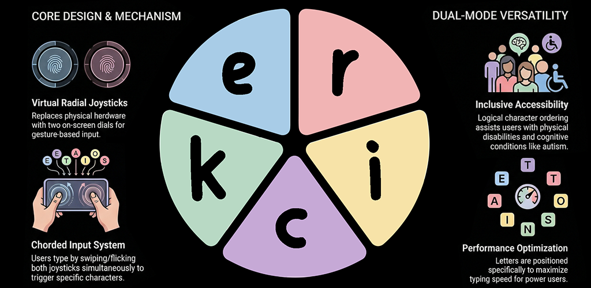

<a name="readme-top"></a>

<div align="center">
  <h3 align="center">Ergonomic Radial Inclusive Controller Keyboard (ERICK)</h3>
  <p align="center"><strong>Current Version: v1.2.0</strong></p>

  <p align="center">
    An accessibility-first keyboard for Android and iOS that replaces tiny keys with two large directional controls.
    <br />
    Type with touch or a physical game controller, learn with guided quickstart and practice lessons, get offline learned word prediction, and keep every keystroke on your own device.
    <br />
    <br />
    <a href="https://play.google.com/store/apps/details?id=com.vatoo.erick"></a>
    <a href="#availability"></a>
    <br />
    <br />
    <a href="APP_CONTEXT.md"><strong>View Architecture & App Context</strong></a>
    ·
    <a href="docs/documentation/User_Guide.md"><strong>User Guide</strong></a>
    ·
    <a href="docs/documentation/Research/README.md"><strong>Research</strong></a>
    ·
    <a href="AGENTS.md"><strong>AI Agent Guide</strong></a>
    ·
    <a href="CHANGELOG.md"><strong>Changelog</strong></a>
    <br />
    <br />
    <a href="https://github.com/vatsalunadkat/ERICKeyboard/issues">Report Bug</a>
    ·
    <a href="https://github.com/vatsalunadkat/ERICKeyboard/issues">Request Feature</a>
  </p>
</div>

## About The Project
<div align="center">
  
</div>

ERICK is an accessibility-first keyboard. Instead of asking the user to hit rows of small keys, it uses two large directional controls. Moving the left and right controls together creates a character "chord." The same system works with on-screen touch controls or with physical gaming controllers such as DualShock, Xbox, and 8BitDo pads.

ERICK is designed first for people who struggle with standard touch keyboards, especially users with motor limitations, repetitive strain issues, or situations where precise tapping is uncomfortable. At the same time, it can also help many everyday users by making typing more predictable on small screens, enabling controller-based typing on TVs and consoles, and supporting lower-visual-demand typing.

The default Logical layout uses a clear A-Z arrangement to make learning easier for new users and for people who prefer a simple, easy-to-follow pattern. An Efficiency layout is also included for users who want faster typing after practice. ERICK also includes guided quickstart flows, reusable practice lessons and quote practice, controller diagnostics and tuning on Android, offline learned word prediction, live previews, left-handed mode, dyslexia-friendly fonts, colorblind-safe palettes, haptic and controller rumble feedback, and custom layouts.

Everything runs fully offline. ERICK requests no internet permission, collects no typing data, and keeps every keystroke on the device.

## Why ERICK Matters

ERICK is built around the idea that accessibility should improve the product for everyone, not only for a small group of users.

- Large touch targets can help people with limited dexterity, but they also reduce mistakes on small screens.
- Controller support can help users who cannot rely on touch, but it also makes sense for couches, TVs, and gaming setups.
- Predictive text can reduce effort for users with fatigue or motor limitations, while also speeding up everyday typing.
- Offline privacy protects vulnerable users and gives privacy-conscious users a keyboard they can actually trust.

## Key Use Cases

- Accessible typing for people with motor disabilities, limited finger dexterity, or repetitive strain injuries
- Controller-based typing on gaming consoles, smart TVs, and set-top boxes
- Low-visual-demand or eyes-free typing
- Typing while commuting or multitasking
- Privacy-preserving alternative to data-collecting commercial keyboards

### Built With

[](#) [](#) [](#) [](#) [](#) [](#) [](#)

## Availability

- Android: v1.2.0 is available on [Google Play](https://play.google.com/store/apps/details?id=com.vatoo.erick).
- iOS: App Store release coming soon. Source builds remain available from the Xcode project under `ios/`.

## Features

### Current Implementation

- [x] Cross-platform keyboard support on Android and iOS with touch and physical controller input
- [x] Dual-dial chorded typing with 8-section and optional 6-section modes, live previews, and utility swipes
- [x] Multiple typing models and layouts: Quick Type, Steady Type, One-Handed, plus Logical, Efficiency, and Custom layouts
- [x] Offline typing assistance with autocorrect, next-word suggestions, and a locally learned prediction profile
- [x] Guided learning flows including Quickstart, Practice Hub lessons, and quote practice
- [x] Controller-focused features including Android diagnostics, controller tuning, and supported controller rumble
- [x] Accessibility and personalization options including left-handed mode, colorblind-safe palettes, custom colors, theme support, and OpenDyslexic
- [x] Typing polish such as haptic feedback, typing sounds, shift and Caps Lock indicators, accelerating backspace, and offline-first privacy

### Future Directions

- [ ] Multi-language support
- [ ] Improved Word Prediction and User Dictionaries
- [ ] Typing analytics and improvement tracking

## Project Structure

```text
ERICK/
├── android/                     Android implementation
│   ├── app/                     Android app module
│   ├── shared/                  Kotlin Multiplatform shared module
│   └── README.md                Android setup guide
├── ios/                         iOS implementation
│   ├── ERICK/                   Xcode project
│   └── README.md                iOS setup guide
├── docs/                        Website and documentation
│   ├── documentation/
│   │   ├── APP_CONTEXT.md      Mirrored architecture copy for docs navigation
│   │   ├── User_Guide.md
│   │   ├── Jira/
│   │   └── Research/
│   ├── index.html
│   ├── accessibility.html
│   └── privacy-policy.html
├── APP_CONTEXT.md               Canonical architecture doc
├── CHANGELOG.md
├── PROJECT_PROMPT.md
└── README.md
```

## Project Artifacts

### Input Modes
<p>
  
  
  
</p>

### Controller And Accessibility
<p>
  
  
  
</p>

### Practice
<p>
  
</p>

## Documentation

| Document | Description |
| --- | --- |
| [AGENTS.md](AGENTS.md) | Short AI-first workflow, validation commands, and hotspot guide |
| [APP_CONTEXT.md](APP_CONTEXT.md) | Canonical architecture, class diagrams, sequence diagrams, and component docs |
| [User Guide](docs/documentation/User_Guide.md) | End-user guide for typing, settings, accessibility, and troubleshooting |
| [Research](docs/documentation/Research/README.md) | Research notes, layout optimization, and academic references |
| [CHANGELOG.md](CHANGELOG.md) | Version history and release notes |
| [Sprint Archives](docs/documentation/Jira/) | Jira ticket archives |

## AI Tooling

ERICK keeps explicit instruction files for multiple coding agents. These were cross-checked against the tools' documented instruction surfaces on 2026-04-25.

| Tool | Files ERICK maintains | Notes |
| --- | --- | --- |
| GitHub Copilot | `.github/copilot-instructions.md`, `AGENTS.md`, nested `docs/AGENTS.md` | GitHub docs also support `.github/instructions/*.instructions.md`, nested `AGENTS.md`, and root `CLAUDE.md`. ERICK keeps shared guidance in `AGENTS.md` and uses Copilot-specific overlay instructions in `.github/`. |
| Claude Code | `CLAUDE.md`, nested `docs/CLAUDE.md` | Anthropic docs say Claude reads `CLAUDE.md`, not `AGENTS.md` directly, so ERICK imports `AGENTS.md` from `CLAUDE.md` to keep the rules aligned. |
| Cursor | `.cursor/rules/erick-ai-first.mdc`, `AGENTS.md`, nested `docs/AGENTS.md` | Cursor project rules are the primary editor-native surface. Cursor also supports plain `AGENTS.md` files in the root and subdirectories. |
| Codex | `AGENTS.md`, nested `docs/AGENTS.md` | OpenAI docs say Codex layers `AGENTS.md` files from the repo root down to the current working directory, with nearer files taking precedence. |

Important scoped files for lower-context or weaker models:

- `android/AGENTS.md` and `android/CLAUDE.md` for Android UI, IME, and screen-size guidance
- `ios/AGENTS.md` and `ios/CLAUDE.md` for iOS keyboard-extension and host-app layout guidance
- `docs/AGENTS.md` and `docs/CLAUDE.md` for website responsiveness, mirrored docs, and diagram updates
- `docs/documentation/Research/AGENTS.md` and `docs/documentation/Research/CLAUDE.md` for Python research scripts and reproducible research workflow

When you update shared AI workflow rules, keep these files aligned: `AGENTS.md`, `CLAUDE.md`, `android/AGENTS.md`, `android/CLAUDE.md`, `ios/AGENTS.md`, `ios/CLAUDE.md`, `docs/AGENTS.md`, `docs/CLAUDE.md`, `docs/documentation/Research/AGENTS.md`, `docs/documentation/Research/CLAUDE.md`, `.cursor/rules/erick-ai-first.mdc`, and `.github/copilot-instructions.md`.

## Contributing

1. Fork the repository.
2. Create a feature branch: `git checkout -b feature/your-feature`
3. Make your changes and ensure they build on both platforms.
4. Commit with a descriptive message.
5. Open a pull request against `main`.

Please read the platform-specific setup guides before contributing:

- [Android setup](android/README.md)
- [iOS setup](ios/README.md)

## Contributors

<p>
  <a href="https://github.com/bisensamiksha"></a>
  <a href="https://github.com/xingxingyxx"></a>
  <a href="https://github.com/aditursynn"></a>
  <a href="https://github.com/agpaneri-98"></a>
  <a href="https://github.com/nazgulengvall"></a>
  <a href="https://github.com/VilgotM"></a>
</p>

Samiksha Bisen (Android and iOS), Xingxing Yang (Kotlin Multiplatform and controller support), Adilet Tursynn (Research), Angeliki Paneri (UI/UX Design), Nazgul Engvall (Android settings), and Vilgot M (Android UI and polish).

## License

This project is **source available**, not open source. It is free for personal, educational, and accessibility use. Commercial use and modified redistribution require written permission. See [LICENSE](LICENSE) for full terms.

## Contact

Vatsal Paresh Unadkat  
LinkedIn: [https://www.linkedin.com/in/vatsalunadkat/](https://www.linkedin.com/in/vatsalunadkat/)  
Project Link: [https://github.com/vatsalunadkat/ERICKeyboard](https://github.com/vatsalunadkat/ERICKeyboard)

<p align="right">(<a href="#readme-top">back to top</a>)</p>
